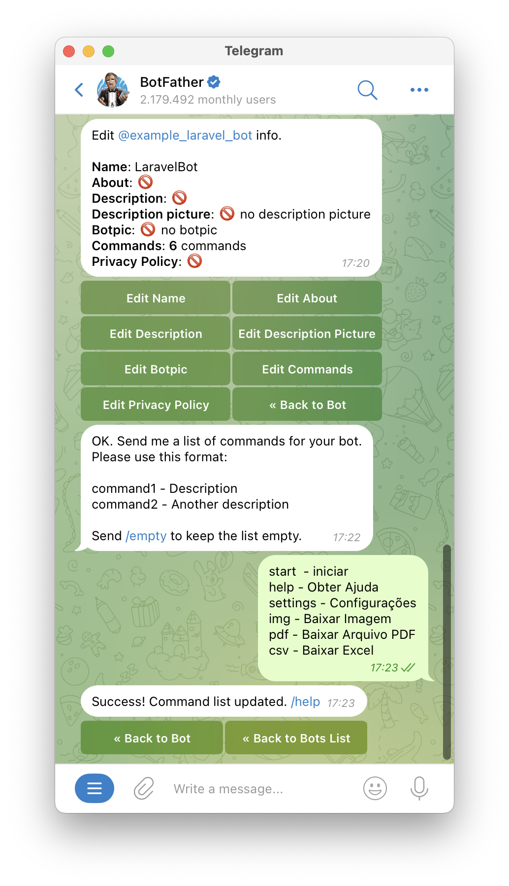
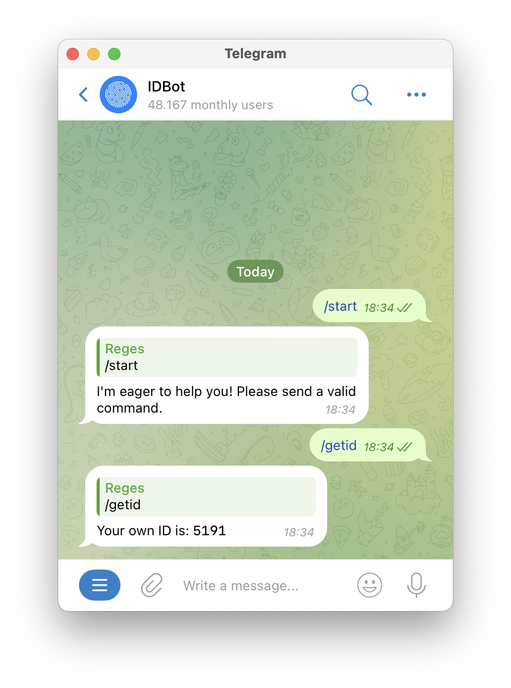
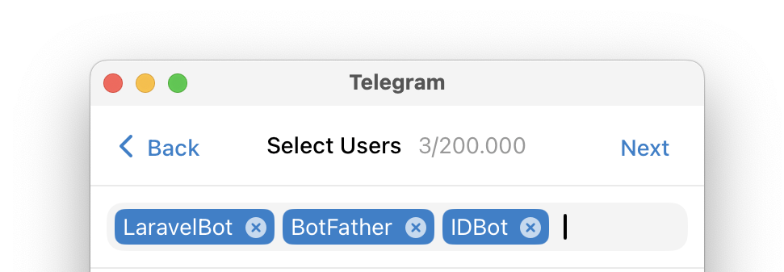

## INTEGRE SUA EMPRESA COM A API DO TELEGRAM

### Que tal integrar sua empresa com a API do Telegram?

Por meio da API do Telegram você pode consultar dados de sua empresa de forma remota e fácil! E o melhor de tudo: na palma da sua mão, por meio do seu celular, tablet ou computador!

### Resumo do funcionamento
Esse projeto é um exemplo de implementação de um mini ERP feito com o Framework PHP [Laravel](https://laravel.com), que simula as aplicações da empresa, e que podem enviar dados para o usuário do Telegram, tanto individualmente, quanto coletivamente (por meio de grupos).

Por outro lado, caso um cliente queira consultar algum dado da empresa, poderá utilizar o Telegram para realizar consultas diversas, baixar relatórios em Excel, Relatórios em PDF, Imagens, etc.

### Amostra Grátis! :)
Veja abaixo o visual do ERP exemplo!
Por meio dele, você poderá disparar diversos tipos de mensagens, conforme os botões disponíveis.


## COMO INSTALAR?

#### Requisitos
Laravel 11.9+ 
PHP 8.3
Docker Desktop (ou Herd)
Ngrok

## Bom, vamos lá! Step-by-step!
### Instalação do Framework Laravel PHP.
Para instalar o [Framework Laravel PHP](https://laravel.com/docs/11.x/installation), será utilizado o [Docker Desktop](https://www.docker.com/products/docker-desktop/) neste tutorial. Porém caso prefira não utilizá-lo, você poderá utilizar o Herd ou Sails para testar a aplicação.

Apenas utilizei o Docker para demonstrar o meu outro projeto disponível no link: [https://github.com/KeystoneDevBr/docker_for_laravel](https://github.com/KeystoneDevBr/docker_for_laravel).


#####  Passo 1: Baixar o Repositório do Projeto.
```
git clone https://github.com/KeystoneDevBr/laravel_with_telegram.git
```

##### Passo 2: Instalar as Dependências do Projeto.
```
cd /laravel_with_telegram

./docker-compose.sh --build
```
##### Passo 3: Acessar o container do PHP e instalar o Composer + dependências.
```
docker ps #Mostra os containers disponíveis

docker exec -it <id_do_container_do_php> bash

example_app_dev> composer install
example_app_dev> php artisan migrate --seed
example_app_dev> php artisan config:cache
```
Também é possível acessar o container do PHP (example_app_dev) por meio das ações disponíveis na aba "Quick Actions" do Docker Desktop.


##### Passo 4: Acessar a Aplicação Web.
Uma vez executado o Passo 3, já possível acessar a interface gráfica da aplicação WEB.
Obs.: como o Bot do Telegram ainda não foi criado, e o agente do [Ngrok](https://ngrok.com/) ainda não foi instalado as ações disponíveis não serão executadas conforme esperado.
```
https://localhost:443
```
Utilizar as credenciais: Usuários: telegram@gmail.com, Senha: telegram


### Criando o Bot do Telegram.
Nessa etapa, será demostrado como criar um Bot no Telegram, e obter o Token, bem como fazer as configurações iniciais do Bot.

##### Passo 5: Criar o Bot utilizando o @BotFather.
Abra o Telegram, e acesse o @BotFather e execute os comandos a seguir:


**Atenção!** 
Anote o Token fornecido na variável **TELEGRAM_BOT_TOKEN** , dentro do arquivo .env
```
TELEGRAM_BOT_TOKEN=7557866720:AAF7gFEqZZys-61h0xDW0kyGat_isT0AxlM
```


##### Passo 6: Configurar os comandos padrões do Bot Recém criado.
Ainda com o chat do @BotFather aberto, selecione a opção */mybots* para concluir as configurações do bot recém criado.
Siga o caminho: @example_laravel_bot >> Edit Bot >> Edit Commands, e insira os comandos a seguir:
```
start  - iniciar
help - Obter Ajuda
settings - Configurações
img - Baixar Imagem
pdf - Baixar Arquivo PDF
csv - Baixar Excel
```



##### Passo 7: Acessando o novo Bot.
Abra o Telegram e inicie uma conversa com o novo Bot criado


##### Passo 8: Obtendo o ID do Novo Bot.
Para possibilitar o envio de mensagem a partir da Aplicação Web, tanto para um usuário único, quanto para um grupo, é necessário obter o ID do usuário, para envio individual, ou o ID do grupo.
Primeiro, vamos obter o ID do usuário:

Passo 8.1: Acesso o Bot do Telegram @myidbot, e envie o comando: /getId, e anote o ID informado:


Armazene o valor do id, na variável **TELEGRAM_USER_ID** do arquivo .env

```
TELEGRAM_USER_ID=5191********
```

##### Passo 9(Opcional): Obtendo o ID do Grupo para Recebimento de mensagens via Grupo.

No telegram, selecione a opção Criar grupo, e adicione os seguintes usuários:
@example_laravel_bot
@BotFather
@myidbot



Anote o valor do ID do grupo na variável ***TELEGRAM_GROUP_ID*** do arquivo .env
```
TELEGRAM_GROUP_ID=-4572357303
```

##### Passo 10: Criar Token Para Recebimento de Mensagem via API.
Para possibilitar o recebimento seguro de mensagens enviadas pela API do telegram, via WebHook, crie um token e armazene seu valor na variável **** do arquivo .env
```
WEBHOOK_SECRET_TOKEN=youtSecretTokenHere
```

Ao final do Passo 10, seu arquivo .env deverá se parecer com a imagem a seguir:


### Configurando o WebHook com Ngrok.
Com as configurações realizadas até o momento, e após recarregar o cache do Framework Laravel (php artisan config:cache) só é possível realizar o envio de mensagens no sentido Aplicação Web ==> Usuário do Telegram.

Para possibilitar que o Telegram envie atualizações (ou seja Updates como é chamado) à aplicação. Esta deve possuir uma rota de entrada disponível na Internet.

Para prover essa exposição, neste exemplo será empregado a ferramenta conhecida como [Ngrok](https://www.ngrok.com). Por fugir do escope do projeto, o passo a passo de como instalar o agente não será detalhado. 

Após instalação do Agente siga os passos adiante:

##### Passo 11: Publicar caminho do WebHook na Internet.
Abra o terminal da máquina, e execute o agente do Ngrok apontando para a aplicação já em execução.
Como a aplicação utiliza https por padrão, a porta 443 deverá ser especificada.
```
ngrok http localhost:443
```


Copie a URL gerada, e visível na linha *Forwarding*, e armazene-a na variável **NGROK_URL** do arquivo .env
```
NGROK_URL=https://7ab7-2804-214-87fd-bffa-9dea-a67a-2390-bc74.ngrok-free.app
```

Após isso, recarregue o cache do laravel, e volte ao Dasbhoard da Aplicação Web.

```
example_app_dev> php artisan config:cache
```

Acesse a Aplicação Web publicada na Internet, para certificar-se de que está tudo funcionando corretamente, clique no botão **Visit Site**
```
https://7ab7-2804-214-87fd-bffa-9dea-a67a-2390-bc74.ngrok-free.app
```


##### Passo 12: Buscando a Última Mensagem do Bot.
Por padrão o telegram não ativa o envio de mensagem via WebHook para a aplicação Web. Apenas a consulta das mensagens do chat é habilitada.

Para consultar a última mensagem enviada no Chat do Bot, clique no botão "getUpdates". A última mensagem será exibida em um anova Aba.


##### Passo 13: Ativando o WebHook para recebimento de Updates.
Para ativar o envio de Updates da API do Telegram para a Aplicação Web, selecione o botão "setWebHook".
A aplicação web enviará uma mensagem ao Telegram, indicando o caminho completo do WebHook, para recebimentos dos mensagens.


Selecione o botão "getWebHookInfo" para visualiar as configurações salvas no Bot do  Telegram


### Interagindo com o Bot criado
Agora que o webhook foi ativado, já é possível interagir como bot criado.
Os comandos enviado via bot serão encaminhados para a Aplicação Web, e esta responderá de acordo com a mensagem enviada.

Por outro lado, a Aplicação Web poderá enviar diversos tipos de mensagens para o bot, bastando selecionar uma das opções disponíveis no dashboard.

##### Exemplos de Interações com o Bot


